# Enterprise Multi-Cloud IAM Automation System

[](https://github.com/your-org/iam-automation/actions)
[](https://github.com/your-org/iam-automation/actions)
[](https://github.com/your-org/iam-automation/actions)

## Overview

Enterprise-grade multi-cloud IAM automation system designed for companies like Google, Netflix, and other hyperscale organizations. This solution automates IAM user, role, and policy provisioning across AWS, Google Cloud Platform (GCP), and Microsoft Azure with industry-leading security, monitoring, and observability features.

## Key Features

### 🌐 Multi-Cloud Support
- **AWS**: IAM Users, Roles, Policies, Groups, Service Accounts
- **GCP**: Service Accounts, IAM Roles, Custom Roles, Organization Policies
- **Azure**: Users, Service Principals, Role Assignments, Custom Roles

### 🏗️ Enterprise Architecture
- **Terraform Modules**: Reusable, composable infrastructure components
- **GitHub Actions**: Advanced CI/CD with multi-stage approval workflows
- **State Management**: Remote state with encryption and locking
- **Multi-Environment**: Dev, Staging, Production with isolated deployments

### 🔒 Security & Compliance
- **Zero Trust Architecture**: Principle of least privilege
- **Policy as Code**: Version-controlled security policies
- **Compliance Frameworks**: SOC2, PCI-DSS, HIPAA, ISO 27001
- **Secret Management**: HashiCorp Vault, AWS Secrets Manager, Azure Key Vault
- **Audit Logging**: Comprehensive audit trails and compliance reporting

### 📊 Monitoring & Observability
- **Real-time Dashboards**: Grafana with custom metrics
- **Alerting**: PagerDuty, Slack, Teams integration
- **Logging**: ELK Stack, CloudWatch, Azure Monitor
- **Metrics**: Prometheus, DataDog, custom metrics
- **Tracing**: Distributed tracing for complex workflows

### 🚀 Scalability & Reliability
- **Horizontal Scaling**: Handle 1000+ AWS accounts
- **Fault Tolerance**: Circuit breakers, retry mechanisms
- **Rate Limiting**: Intelligent throttling and backoff
- **Disaster Recovery**: Multi-region deployment support
- **High Availability**: 99.99% uptime SLA

## 🏗️ Architecture Overview

The Enterprise Multi-Cloud IAM Automation System follows a hub-and-spoke architecture designed for maximum scalability, security, and operational excellence.

### 🎯 **Core Architecture Principles**
- **Multi-Cloud Native**: Unified management across AWS, GCP, and Azure
- **GitOps Driven**: All changes tracked and version controlled
- **Zero-Trust Security**: Principle of least privilege throughout
- **Observability First**: Comprehensive monitoring and alerting
- **Scalable Design**: Handle 1000+ accounts/projects/subscriptions per cloud

### 📊 **System Architecture Diagram**

```mermaid
graph TB
    %% Source Control & CI/CD Layer
    subgraph "🔄 Source Control & CI/CD"
        A[GitHub Repository] --> B[GitHub Actions Pipeline]
        B --> B1[Security Scanning]
        B --> B2[Multi-Cloud Deploy Action]
        B --> B3[Chaos Engineering Tests]
        B1 --> B4{Quality Gates}
        B2 --> B4
        B3 --> B4
    end

    %% Environment Management Layer
    subgraph "🌍 Environment Management"
        B4 -->|✅ Passed| C{Environment Router}
        C -->|Dev| D[Development Environment]
        C -->|Staging| E[Staging Environment]  
        C -->|Production| F[Production Environment]
    end

    %% Multi-Cloud Deployment Layer
    subgraph "☁️ Multi-Cloud Resources"
        %% AWS Resources
        subgraph "🟠 AWS Infrastructure"
            D --> G[AWS Dev Accounts<br/>1-300]
            E --> J[AWS Staging Accounts<br/>301-600]
            F --> M[AWS Production Accounts<br/>601-1000+]
            
            G --> G1[IAM Users & Roles]
            G --> G2[Policies & Groups]
            G --> G3[Cross-Account Roles]
            J --> J1[IAM Users & Roles]
            J --> J2[Policies & Groups]
            M --> M1[IAM Users & Roles]
            M --> M2[Policies & Groups]
            M --> M3[Enterprise Controls]
        end

        %% GCP Resources
        subgraph "🔵 GCP Infrastructure"
            D --> H[GCP Dev Projects<br/>1-300]
            E --> K[GCP Staging Projects<br/>301-600]
            F --> N[GCP Production Projects<br/>601-1000+]
            
            H --> H1[Service Accounts]
            H --> H2[Custom Roles]
            H --> H3[IAM Bindings]
            K --> K1[Service Accounts]
            K --> K2[Custom Roles]
            N --> N1[Service Accounts]
            N --> N2[Custom Roles]
            N --> N3[Org Policies]
        end

        %% Azure Resources
        subgraph "🟣 Azure Infrastructure"
            D --> I[Azure Dev Subscriptions<br/>1-300]
            E --> L[Azure Staging Subscriptions<br/>301-600]
            F --> O[Azure Production Subscriptions<br/>601-1000+]
            
            I --> I1[Azure AD Users]
            I --> I2[Service Principals]
            I --> I3[Role Assignments]
            L --> L1[Azure AD Users]
            L --> L2[Service Principals]
            O --> O1[Azure AD Users]
            O --> O2[Service Principals]
            O --> O3[Conditional Access]
        end
    end

    %% Observability & Monitoring Layer
    subgraph "📊 Observability Stack"
        P[Prometheus Metrics] --> S[Grafana Dashboards]
        Q[Loki Logs] --> S
        R[Jaeger Traces] --> S
        T[Custom Metrics Exporter] --> P
        
        S --> S1[Executive Dashboard]
        S --> S2[Operational Dashboard]
        S --> S3[Security Dashboard]
        S --> S4[Compliance Dashboard]
        
        U[AlertManager] --> V[PagerDuty]
        U --> W[Slack Notifications]
        U --> X[Email Alerts]
    end

    %% Security & Compliance Layer
    subgraph "🛡️ Security & Governance"
        Y[Audit Logging] --> Z[CloudTrail/Activity Logs]
        AA[Policy Enforcement] --> BB[OPA Gatekeeper]
        CC[Secret Management] --> DD[Vault/Key Vaults]
        EE[Compliance Scanning] --> FF[SOC2/ISO27001 Reports]
        
        Z --> GG[Compliance Database]
        BB --> GG
        DD --> GG
        FF --> GG
    end

    %% Data Flow Connections
    G1 --> P
    G2 --> Q
    H1 --> P
    H2 --> Q
    I1 --> P
    I2 --> Q
    J1 --> T
    K1 --> T
    L1 --> T
    M1 --> Y
    N1 --> Y
    O1 --> Y
    
    %% Monitoring Integration
    P -.-> U
    Q -.-> U
    R -.-> U
    
    %% Security Integration
    B1 -.-> AA
    G3 -.-> CC
    H3 -.-> CC
    I3 -.-> CC
```



### 🔧 **Component Architecture**

#### **1. CI/CD Pipeline Layer**
- **GitHub Actions**: Advanced workflows with approval gates
- **Security Scanning**: Bandit, Safety, Checkov, Semgrep integration
- **Multi-Cloud Deploy**: Custom action for parallel deployments
- **Chaos Engineering**: Automated resilience testing

#### **2. Terraform Infrastructure**
- **Modular Design**: Cloud-specific modules with shared patterns
- **State Management**: Remote state with encryption and locking  
- **Variable Management**: Environment-specific configurations
- **Output Integration**: Structured outputs for monitoring

#### **3. Multi-Cloud Resources**
- **AWS IAM**: Users, roles, policies, groups, cross-account access
- **GCP IAM**: Service accounts, custom roles, organization policies
- **Azure AD**: Users, service principals, conditional access, PIM

#### **4. Observability Stack**
- **Metrics**: Prometheus with custom exporters for all clouds
- **Logging**: Loki for centralized log aggregation
- **Tracing**: Jaeger for distributed request tracing
- **Dashboards**: Grafana with executive and operational views
- **Alerting**: Intelligent routing with escalation policies

#### **5. Security & Governance**
- **Zero-Trust**: Default deny with explicit allow policies
- **Audit Logging**: Comprehensive trails across all clouds
- **Secret Management**: Centralized secret rotation and access
- **Compliance**: Automated evidence collection and reporting

### 📈 **Scalability Metrics**

| Component | Development | Staging | Production |
|-----------|-------------|---------|------------|
| **AWS Accounts** | 300 | 300 | 400+ |
| **GCP Projects** | 300 | 300 | 400+ |
| **Azure Subscriptions** | 300 | 300 | 400+ |
| **Concurrent Deployments** | 10 | 20 | 50 |
| **Batch Size** | 5 | 10 | 20 |
| **SLA Target** | 99.5% | 99.9% | 99.99% |

### 🚀 **Enterprise Features**

#### **High Availability**
- Multi-region deployment support
- Automated failover and recovery
- Circuit breaker patterns
- Graceful degradation strategies

#### **Security Excellence**
- Multi-factor authentication enforcement
- Privileged access management (PAM/PIM)
- Customer-managed encryption with HSM
- Continuous security monitoring

#### **Operational Excellence**
- Blue-green and canary deployments
- Automated rollback capabilities
- Comprehensive health checks
- Performance optimization

#### **Compliance Ready**
- SOC2, PCI-DSS, HIPAA, ISO27001 support
- Automated audit evidence collection
- Data governance and lineage tracking
- GDPR compliance features

## Architecture
    C -->|Dev| D[Dev Account Pool]
    C -->|Staging| E[Staging Account Pool]
    C -->|Production| F[Production Account Pool]
    
    D --> G[AWS Accounts 1-100]
    D --> H[GCP Projects 1-100]
    D --> I[Azure Subscriptions 1-100]
    
    E --> J[AWS Accounts 101-500]
    E --> K[GCP Projects 101-500]
    E --> L[Azure Subscriptions 101-500]
    
    F --> M[AWS Accounts 501-1000+]
    F --> N[GCP Projects 501-1000+]
    F --> O[Azure Subscriptions 501-1000+]
    
    B --> P[Monitoring Dashboard]
    B --> Q[Notification System]
    B --> R[Audit & Compliance]
    
    P --> S[Grafana]
    P --> T[DataDog]
    Q --> U[PagerDuty]
    Q --> V[Slack]
    R --> W[CloudTrail]
    R --> X[Azure Activity Log]
```

## Quick Start

### Prerequisites
- Terraform >= 1.5.0
- GitHub CLI
- AWS CLI v2
- Azure CLI
- gcloud CLI
- Docker (for local testing)

### Initial Setup

1. **Clone and Configure**
```bash
git clone https://github.com/your-org/iam-automation.git
cd iam-automation
cp config/environments/dev/terraform.tfvars.example terraform.tfvars
```

2. **Configure Cloud Credentials**
```bash
# AWS
aws configure sso

# Azure
az login

# GCP
gcloud auth application-default login
```

3. **Initialize Terraform**
```bash
cd terraform/environments/dev
terraform init
terraform plan
terraform apply
```

4. **Deploy Monitoring Stack**
```bash
cd monitoring
docker-compose up -d
```

## Directory Structure

```
├── .github/                           # GitHub Actions workflows
│   ├── workflows/                     # CI/CD pipelines
│   ├── templates/                     # Issue and PR templates
│   └── CODEOWNERS                     # Code ownership
├── terraform/                         # Infrastructure as Code
│   ├── modules/                       # Reusable Terraform modules
│   │   ├── aws/                       # AWS-specific modules
│   │   ├── gcp/                       # GCP-specific modules
│   │   ├── azure/                     # Azure-specific modules
│   │   └── shared/                    # Cross-cloud modules
│   └── environments/                  # Environment-specific configs
├── config/                           # Configuration files
├── scripts/                          # Automation scripts
├── monitoring/                       # Monitoring and alerting
├── docs/                            # Documentation
├── tests/                           # Test suites
└── examples/                        # Usage examples
```

## Configuration

### Account Management
Configure your cloud accounts in `config/accounts/`:

```yaml
# config/accounts/aws-accounts.yaml
aws:
  production:
    - account_id: "123456789012"
      region: "us-east-1"
      environment: "prod"
    - account_id: "123456789013"
      region: "us-west-2"
      environment: "prod"
  staging:
    - account_id: "123456789014"
      region: "us-east-1"
      environment: "staging"
```

### IAM Policies
Define IAM policies in `config/policies/`:

```json
{
  "Version": "2012-10-17",
  "Statement": [
    {
      "Effect": "Allow",
      "Action": ["s3:GetObject"],
      "Resource": "arn:aws:s3:::your-bucket/*"
    }
  ]
}
```

## Usage Examples

### Creating IAM Resources

```yaml
# examples/iam-user-creation.yaml
iam_users:
  - name: "john.doe"
    email: "john.doe@company.com"
    department: "engineering"
    role: "developer"
    access_level: "read-write"
    tags:
      cost_center: "engineering"
      project: "web-app"
```

### Bulk Operations

```bash
# Deploy to all production accounts
./scripts/bulk-deploy.sh --environment production --accounts all

# Deploy specific module
./scripts/bulk-deploy.sh --module aws-iam-roles --accounts production
```

## Monitoring & Dashboards

Access the monitoring dashboard at: `https://monitoring.your-company.com`

### Key Metrics
- **Success Rate**: 99.9% deployment success
- **Response Time**: < 30 seconds average
- **Error Rate**: < 0.1% error rate
- **Coverage**: 1000+ accounts managed

### Alerts
- Failed deployments
- Policy violations
- Unusual access patterns
- Compliance issues

## Security

### Best Practices Implemented
- ✅ Principle of least privilege
- ✅ Regular access reviews
- ✅ Multi-factor authentication
- ✅ Encryption at rest and in transit
- ✅ Security scanning and vulnerability management
- ✅ Audit logging and monitoring

### Compliance
- SOC 2 Type II
- PCI DSS Level 1
- HIPAA Compliant
- ISO 27001 Certified
- GDPR Compliant

## Contributing

See [CONTRIBUTING.md](CONTRIBUTING.md) for contribution guidelines.

## Support

- 📧 Email: iam-automation@company.com
- 💬 Slack: #iam-automation
- 🎫 Issues: GitHub Issues
- 📚 Documentation: [docs/](docs/)

## License

Licensed under the MIT License. See [LICENSE](LICENSE) for details.

## Changelog

See [CHANGELOG.md](CHANGELOG.md) for version history and updates.
